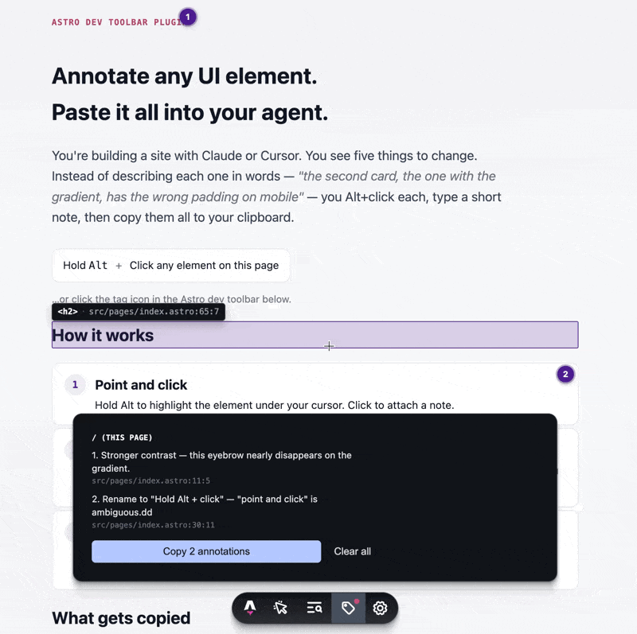

# Astro Agent Annotate Devbar Utility

Annotate the UI you're looking at, paste it all into your agent.



## What it does

You're building a site with Claude or Cursor. You scan the page and see five things to change. Normally you'd type them out as context: *"the second card with the gradient, on mobile, the CTA inside it…"*. That's tedious and burns tokens.

`astro-agent-annotate` is an Astro dev toolbar plugin. Hold **Alt**, click any element, type a short note. A bubble marks the element. Notes persist across reloads and accumulate across routes. One click in the toolbar copies them all as markdown, each with the exact `src/path/File.astro:line:col`.

It only runs during `astro dev`. Your production build is untouched.

## Install

```sh
pnpm add -D astro-agent-annotate
```

```js
// astro.config.mjs
import { defineConfig } from "astro/config";
import astroAgentAnnotate from "astro-agent-annotate";

export default defineConfig({
  integrations: [astroAgentAnnotate()],
});
```

Run `pnpm dev`. Look for the tag icon in the Astro dev toolbar, hold **Alt**, and click.

## Activation

Two ways to enter annotate-mode:

1. Hold **Alt** at any time. The element under your cursor outlines in purple with a tag and source tooltip. Click to drop a note.
2. Click the toolbar tag icon. Same effect as Alt, but it stays on until you press **Esc** or click the icon again. Useful before you've learned the shortcut.

## Notes and bubbles

The note popup opens next to the clicked element. The source path (`src/components/Foo.astro:42:6`) is shown as a header. **Enter** saves, **Esc** cancels, and Delete is available when editing an existing note.

After saving, the element keeps a small purple bubble in the corner. Click the bubble to re-open the note. Bubbles re-anchor on reload and track elements when layout shifts (via `requestAnimationFrame`).

Click-outside behavior depends on whether the popup has changes:

- Empty or unchanged: dismisses the popup.
- Unsaved changes: defocuses only, so you can't lose work.
- Lands on another bubble with no unsaved changes: switches to that one.

## Cross-page sessions

Annotations live in `localStorage` keyed by `window.location.pathname`. Annotate on `/`, navigate to `/about`, annotate more. The toolbar panel shows every pending note across every URL, with a single **Copy N annotations across M pages** action.

## Clipboard format

Markdown grouped by page. Not XML, not JSON.

```markdown
# Annotations
_Collected 2026-05-22T18:49:00.000Z_

## `/about` — 1 note

1. **The CTA feels too small on mobile.**
   - `src/components/Hero.astro:7:23`
   - `<button class="cta">Get started</button>`

## `/pricing` — 1 note

2. **The tiers should be visually distinct.**
   - `src/pages/pricing.astro:9:6`
```

Copying clears every pending annotation across every URL.

## How it works (internals)

The `astro:config:setup` hook registers a dev toolbar app via `addDevToolbarApp` and adds a small Vite plugin. Both self-gate to `command === "dev"`.

The Vite plugin rewrites Astro's native `data-astro-source-file` attribute from an absolute path to one relative to the project root, so the runtime shows `src/foo/Bar.astro` instead of `/Users/you/project/src/foo/Bar.astro`.

A `MutationObserver` captures `data-astro-source-file` and `data-astro-source-loc` as elements enter the DOM. This runs before Astro's audit toolbar strips them, so the click handler can still find them. When Astro splits file and loc onto different ancestors, the resolver walks ancestors and fills them in independently.

A body-level transparent overlay tracks Alt-held state, draws the hover outline, and intercepts clicks in the capture phase. The popup, bubbles, and overlay each live in their own shadow root, so the host page's CSS doesn't reach them.

The toolbar's notification dot is rendered as a CSS `::before` circle. A stylesheet injected into `astro-dev-toolbar`'s shadow root overrides Astro's default rect SVG with `!important` (Astro's `--fill-default` is set inline, which `!important` beats).

## Configuration

```ts
astroAgentAnnotate({
  disabled?: boolean; // skip the integration entirely (default: false)
});
```

That's the whole config surface. Customization for the modifier key and theme may follow if there's demand.

## Credits and prior art

Three earlier projects shaped this one. Where their approach fit, I borrowed.

[omniaura/astro-grab](https://github.com/omniaura/astro-grab) is the original Astro dev toolbar plugin for grabbing element source. I borrowed the modifier-key (Alt) activation, the dev-only gating, and the general integration shape (Vite plugin plus toolbar app). astro-grab focuses on copying source paths fast; this project layers notes on top.

[XKonstX/astro-inspect-clip](https://github.com/XKonstX/astro-inspect-clip) showed the source-attribute-caching trick. Astro's audit toolbar strips `data-astro-source-file` and `data-astro-source-loc` at runtime, which breaks naive readers. The `MutationObserver` cache in astro-inspect-clip is the solution I adopted in [`src/client/source.ts`](./src/client/source.ts), credited in that file's comments.

[benjitaylor/agentation](https://github.com/benjitaylor/agentation) is a React-only annotation toolbar with markdown exports. It nudged me toward the notes-and-export model rather than one-shot source grabbing, and toward markdown over XML or JSON for the clipboard.

How we're different:

- Dual activation: both Alt-held and a sticky toolbar button. The Alt gesture is fast once you know it. The button gives first-time users a way in.
- Per-element popup with a note field. The input lives next to what you clicked, not in a separate panel.
- Persistent bubbles anchored to live `getBoundingClientRect` and tracked with `requestAnimationFrame`. They stay attached on responsive layouts instead of drifting like absolute pins do.
- Per-URL `localStorage` and a single cross-page Copy. One paste covers the whole site.
- Click-outside-with-dirty-check. Clean popups dismiss; dirty ones lose focus only. You can't lose an in-progress note by accident.
- Smaller Vite plugin. astro-grab walks the Astro AST. This one relativizes the path on Astro's existing source attribute and skips the `@astrojs/compiler` dependency.

Use astro-grab if you just want to copy a path. Use astro-inspect-clip for multi-select source inspection without notes. agentation is the option if you're not on Astro. This project fits when you want to batch notes across a whole site and paste them at once.

## Development

The repo is a single package with a sibling demo directory:

- The package source lives at the root. `pnpm build` produces `dist/`.
- `demo/` is a standalone Astro site that depends on the package via `"astro-agent-annotate": "file:.."`. Build the package first, then install and run the demo.

```sh
pnpm install        # install the package's build deps
pnpm build          # produces dist/
cd demo
pnpm install        # links the parent package via file:..
pnpm dev            # open the URL Astro prints
```

## License

MIT.
